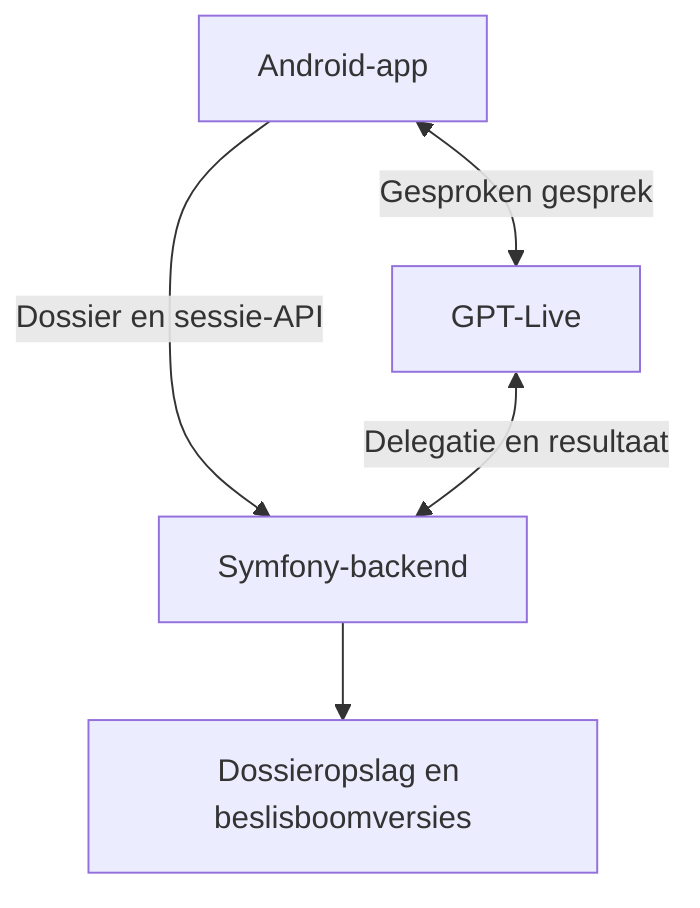

# Projectoverzicht — Woningtriage

Versie 0.2 · 15 september 2026 · Status: ontwerpspecificatie, nog niet geïmplementeerd.

## 1. Doel

Een bewoner voert op een Android-telefoon of -tablet een natuurlijk gesprek over een probleem in huis. De applicatie verzamelt voldoende betrouwbare informatie om het probleem over te dragen aan een medewerker van een onderhoudsorganisatie.

De structuur is LEDO: **Locatie, Element, Defect, Oorzaak**. Een beslisboom bepaalt welke aanvullende informatie nodig is. De bewoner hoeft die structuur niet te kennen en hoeft niet in een vaste volgorde te antwoorden.

Het resultaat is een bevestigd, gestructureerd intakedossier met een Nederlandse werkomschrijving. Het dossier beschrijft waarnemingen, onbekende gegevens en eventueel vermoedens afzonderlijk. Het is geen garantie op een technische diagnose of een uitgevoerde reparatie.

## 2. Bevestigde eisen en ontwerpstatus

| ID | Eis | Status |
| --- | --- | --- |
| REQ-01 | Zelfstandige Android-app | Bevestigd door Wim |
| REQ-02 | Gesproken intake via OpenAI GPT-Live | Bevestigd door Wim |
| REQ-03 | Locatie, Element, Defect en Oorzaak als structuur | Bevestigd door Wim |
| REQ-04 | Doorvragen aan de hand van een beslisboom | Bevestigd door Wim |
| REQ-05 | Nieuwe gesprekken beginnen in het Nederlands | Bevestigd door Wim |
| REQ-06 | Automatisch aansluiten op de taal van de gebruiker | Bevestigd door Wim |
| REQ-07 | Classificatieboom `beslisboom-prod.json` gebruiken | Aangeleverd; gespreksregels nog uitwerken |
| REQ-09 | Duidelijke werkomschrijving als primair resultaat | Bevestigd door Wim |
| REQ-10 | Postcode/huisnummer verzamelen, volledig adres via backend opzoeken en door bewoner verifiëren | Bevestigd door Wim |
| REQ-11 | Aan het einde probleem samenvatten en via backend een record met gespreksdetails maken | Bevestigd door Wim |
| REQ-12 | Reparatieduur niet gebruiken in de app | Bevestigd door Wim |
| REQ-08 | Eerst volledige specificaties documenteren | Bevestigd door Wim |
| DES-01 | Kotlin, Compose en Symfony in één repository | Voorgestelde technische basis |
| DES-02 | Eén primair probleem per intake | Voorstel voor eerste versie |
| DES-03 | Samenvatting, correctie en expliciete bevestiging | Voorstel voor betrouwbare overdracht |
| DES-04 | Nederlandse dossiertekst naast gesprekstaal | Voorstel voor onderhoudsorganisatie |
| DES-05 | Typen als alternatief voor spraak | Voorstel voor toegankelijkheid en herstel |

Een ontwerpvoorstel mag worden uitgewerkt; het wordt niet stilzwijgend als door Wim bevestigde producteis behandeld. Wijzigingen aan scope of veiligheidsbeleid worden in deze documenten bijgewerkt.

## 3. Gebruikers en gebruikssituaties

**Bewoner:** beschrijft een probleem, beantwoordt vragen, corrigeert misverstanden en bevestigt het resultaat. De eerste versie veronderstelt geen technische kennis en stelt één concrete vraag tegelijk.

**Onderhoudsmedewerker:** ontvangt later de gestructureerde gegevens. Een afzonderlijk medewerkersportaal valt buiten de eerste versie.

**Projectbeheerder:** beheert via configuratie de beslisboom, prompts, toegang, bewaartermijnen en modelinstellingen. Een grafische beheerapp is geen onderdeel van deze scope.

De app moet bruikbaar zijn bij een onrustige omgeving, onderbrekingen, een accent, taalwisselingen en een tijdelijk wegvallend netwerk. De gebruiker houdt controle over microfoon, stoppen en bevestigen.

## 4. Eerste oplevering

### Binnen scope

- Android-app voor telefoon en tablet, primair portret maar bruikbaar bij rotatie.
- Startscherm, live gesprek, LEDO-overzicht, correcties en samenvatting.
- Nederlandse opening en meertalige gespreksvoering.
- Symfony API, dossieropslag, versiebeheer en sessiebeheer.
- Vervangbare, versiegebonden beslisboom met een herkenbare demonstratieroute.
- GPT-Live-integratie met backendvalidatie van voorgestelde dossierwijzigingen.
- Herstel van een intake na verbindingverlies zonder dubbele afronding.
- Basisautorisatie, logging zonder gesprekstekst en verwijderbeleid.
- Testscenario's voor domeinlogica, API, taalgedrag en audio op echte apparaten.

### Buiten eerste scope

- iOS, medewerkersportaal en grafische beslisboombewerker.
- Koppelingen met 4PS, planning, verhuurdersportalen of bestaande werkbonsystemen.
- Automatische afspraken, reparatieopdrachten, betalingen of verzending naar derden.
- Foto- en videoanalyse, altijd luisterende microfoon en achtergrondgesprekken.
- Volledige offline AI-intake en automatische medische of bouwkundige diagnose.
- Meerdere gelijktijdige problemen in één dossier; daarvoor kan een volgende intake worden gestart.

## 5. Architectuur

Dit schema toont logische verantwoordelijkheden. De langdurige verbinding met GPT-Live kan een apart workerproces binnen de backend vereisen.

**Android** beheert audio, schermen en gebruikersacties. **Symfony** beheert gevalideerde dossiergegevens, de beslisboom, toegang en bevestigingen. **GPT-Live** verzorgt het gesprek en draagt inhoudelijk werk over aan de backend.

OpenAI beschrijft GPT-Live als een gesprekslaag met afzonderlijke backendverwerking; bij client delegation beheert de toepassing die verwerking zelf. Dit ondersteunt het voorgestelde ontwerp. De toepassing blijft verantwoordelijk voor rechten en duurzame toestand. [OpenAI: Getting started with GPT-Live](https://developers.openai.com/api/docs/guides/live)

De voorgestelde integratierichting is client delegation en WebRTC voor de app. Een technische proef moet de exacte sessieconfiguratie, accounttoegang en serververbinding bevestigen voordat implementatie op die contracten wordt vastgezet. Onze eigen API is beschreven in [API-contract](API_CONTRACT.md).

## 6. Hoofdverloop

1. De bewoner ziet de uitleg, start een intake en geeft zo nodig microfoontoestemming.
2. De backend maakt een dossier met een vaste beslisboomversie.
3. De app opent een spraaksessie; de agent begint in het Nederlands.
4. De bewoner beschrijft het probleem. De taal van diens eigen spraak stuurt de antwoordtaal.
5. De backend verwerkt feitelijke voorstellen en bepaalt de volgende vraag.
6. De bewoner kan op ieder moment corrigeren, dempen of stoppen.
7. Bij voldoende informatie maakt de backend een samenvatting van één dossier-versie.
8. De bewoner controleert of corrigeert de samenvatting en het opgezochte adres. De app laat de backend één definitief meldingsrecord aanmaken; pas na serverbevestiging is de melding opgeslagen.

Bij gevaarsignalen of blijvende onduidelijkheid kan de route eindigen in menselijke beoordeling. De concrete criteria en contactgegevens zijn nog niet geleverd. De app mag zonder werkelijke koppeling nooit zeggen dat een medewerker is ingeschakeld.

## 7. Kwaliteitsdoelen

| Onderwerp | Ontwerpdoel / meetwijze |
| --- | --- |
| Begrijpelijkheid | Eén korte vervolgvraag; geen LEDO-jargon nodig voor bewoner |
| Betrouwbaarheid | Iedere waarde heeft herkomst; vermoedens blijven herkenbaar |
| Correcties | Nieuwe informatie maakt afhankelijke conclusies opnieuw te beoordelen |
| Consistentie | Eén serverdossier; mutaties gebruiken een revisienummer |
| Reactiesnelheid | Meet tijd tot eerste hoorbare reactie; voorlopig streefdoel p95 ≤ 3 s op stabiel netwerk |
| Starten | Voorlopig streefdoel p95 ≤ 5 s tot gereed gesprek, exclusief gebruikerstoestemming |
| Toegankelijkheid | TalkBack, tekstinvoer en bruikbaarheid bij 200% tekstgrootte |
| Herstel | Geen verloren serverbevestigde feiten; geen dubbele bevestiging na retry |
| Kosten | Gebruik per sessie registreren; configureerbare limieten vóór pilot vastleggen |

Dit zijn projectdoelen, geen garanties van OpenAI of Android. De proef bepaalt of aanpassing nodig is.

## 8. Fasering en oplevercriteria

| Fase | Resultaat | Voorwaarde om verder te gaan |
| --- | --- | --- |
| 0 — Specificatie | Deze documenten en open beslispunten | Scope en prioriteiten besproken |
| 1 — Technische proef | Android-audio ↔ GPT-Live ↔ Symfony-delegatie | NL-opening, taalwissel, correctie en sessie-afsluiting op echt apparaat aangetoond |
| 2 — Verticale versie | Volledige demo-intake inclusief opslag en bevestiging | Domein- en API-tests slagen; geen productieclaims |
| 3 — Echte beslisboom | Aangeleverde routes en contactbeleid | Inhoudseigenaar heeft routes en uitkomsten beoordeeld |
| 4 — Pilot | Beperkte gebruikersgroep | Toegang, privacykeuzes, talenmatrix, monitoring en herstel getest |
| 5 — Distributie | Gesigneerde app en beheerde backend | Distributiekanaal en beheerproces vastgesteld |

## 9. Open besluiten

| ID | Besluit | Nodig vóór | Voorgesteld uitgangspunt |
| --- | --- | --- | --- |
| OPEN-01 | Definitieve beslisboom en inhoudseigenaar | Fase 3 | Wim levert aan; versiegebonden JSON |
| OPEN-02 | Spoedcriteria en contact-/overdrachtsroute | Fase 3 | Menselijke beoordeling; geen verzonnen oproepactie |
| OPEN-03 | Wie gebruikt de app en hoe krijgt men toegang? | Pilot | Afgeschermde pilot; geen geheim in APK |
| OPEN-04 | Hosting, regio en providerinstellingen | Technische proef/pilot | Serverconfiguratie; vooraf beschikbaarheid controleren |
| OPEN-05 | Bewaartermijnen, grondslag en privacytekst | Pilot | Geen permanente audio-opnamen als standaard |
| OPEN-06 | Eerste expliciet geteste talen | Fase 1/3 | Nederlands en Engels eerst; overige talen nog niet gevalideerd |
| OPEN-07 | Definitieve appnaam, package-ID en branding | Distributie | Werknaam Woningtriage |
| OPEN-08 | Minimale Android-versie en doelapparaten | Fase 1 | Voorstel Android 10+; telefoon en tablet |
| OPEN-09 | Distributie: APK, besloten test of Play Store | Fase 4 | Besloten test |
| OPEN-10 | Adresprovider en eventuele externe werkbondestination | Adresprovider vóór pilot; externe koppeling later | Adreslookup en definitief meldingsrecord zijn in scope; ruimte ≠ woonadres |
| OPEN-11 | Sessieduur, budget en prestatiegrenzen | Pilot | Configureerbaar; geen veronderstelde providerlimieten |
| OPEN-12 | Database en langdurige verbindingsruntime | Fase 1 | PostgreSQL en Symfony-worker; bevestigen in proef |

## 10. Definitie van gereed

De eerste versie is pas gereed wanneer de relevante criteria in het [testplan](ACCEPTANCE.md) zijn aangetoond, er een installeerbare build is, backendconfiguratie is gedocumenteerd en de beperkingen expliciet zijn. Een succesvolle API-aanroep of overtuigend gesprek alleen is onvoldoende.

Zie de [Android-specificatie](ANDROID_SPEC.md), [backend-specificatie](BACKEND_SPEC.md) en [domeinspecificatie](TRIAGE_SPEC.md) voor de uitwerking.

## 11. Definitief resultaat en adres (scope 0.2)

Naast de locatie binnen het gebouw wordt het woonadres verplicht vastgelegd. De app verzamelt postcode, huisnummer en zo nodig toevoeging. De backend levert het volledige adres terug; de bewoner controleert straat, nummer/toevoeging, postcode en woonplaats. Een gevonden adres is pas geverifieerd na bevestiging door de bewoner; dit is geen bewijs van diens identiteit of bewoning.

De agent vat aan het einde het probleem samen. De app verstuurt daarna een afrondingsverzoek; de backend maakt één duurzaam meldingsrecord met het geverifieerde adres, de werkomschrijving, LEDO/classificatie, bewonersantwoorden, correcties en transcript. Conceptopslag tijdens het gesprek dient herstel en is geen definitieve melding.

`planning_duration` wordt niet getoond, uitgevraagd of gebruikt voor beslissingen, planning of het meldingsrecord. Competentie kan bronmetadata blijven; de eerste versie plant geen reparatie. Met gespreksdetails bedoelen we in dit ontwerp de tekstuele inhoud, taal, sprekers en relevante gebeurtenissen, geen ruwe audio of interne modelredeneringen.
